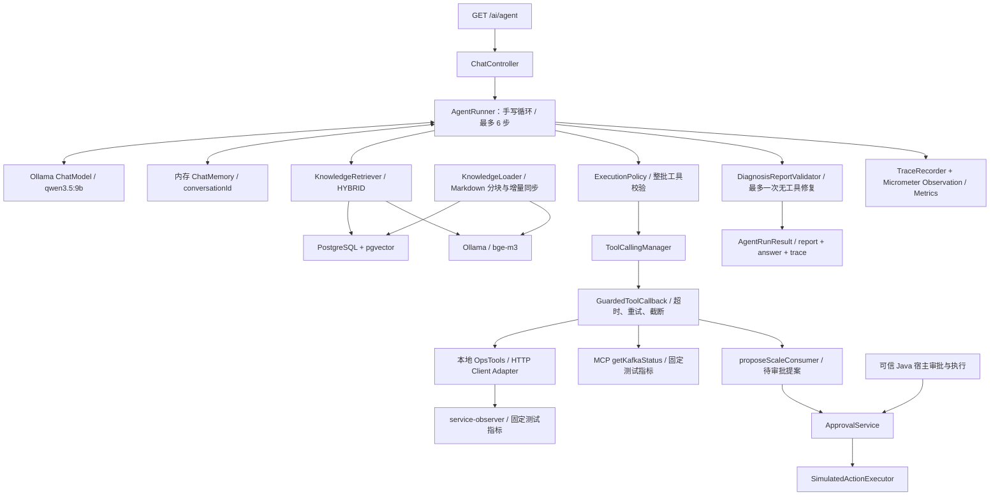

# Java 服务故障排查 Agent

基于 Java 17、Spring Boot 和 Spring AI 的故障排查学习项目：模型查询服务、Kafka、日志与依赖指标，结合知识库生成带证据的结构化诊断，并由 Java Harness 控制工具权限、重试和停止条件。

**Day21 评估：可以开展项目作品化，未发现阻止本次 README 整理的严重问题。** 本文按当前代码及已保存实验记录编写，核对日期为 2026-10-03；Day19 的完整验收和生产质量目标仍未完成。学习路线见 [进阶计划](doc/java-troubleshooting-agent-advanced.md)。

## 1. Architecture



图中是默认 `/ai/agent` 链路。Day20 的 `ManualAgentRunner` 委托原 `AgentRunner`；`AdvisorAgentRunner` 使用 `ToolCallingAdvisor`，由对照测试单独实例化，尚未接入默认 HTTP 入口。

| 代码入口 | 职责 |
|---|---|
| [ChatController](src/main/java/org/example/ai/controller/ChatController.java) | API、会话参数；`/ai/agent` 显式指定 MCP 模式 |
| [AgentRunner](src/main/java/org/example/ai/harness/AgentRunner.java) | 模型与工具循环、检索、记忆、证据目录、输出修复 |
| [ExecutionPolicy](src/main/java/org/example/ai/harness/ExecutionPolicy.java) | 工具和参数白名单、预算、连续重复调用检查 |
| [GuardedToolCallback](src/main/java/org/example/ai/harness/GuardedToolCallback.java) / [ToolFailure](src/main/java/org/example/ai/harness/ToolFailure.java) | 单次工具尝试 3 秒、可恢复错误最多重试一次、结果正文超过 8000 字符截断 |
| [KnowledgeRetriever](src/main/java/org/example/ai/rag/KnowledgeRetriever.java) / [PgKnowledgeIndex](src/main/java/org/example/ai/rag/synchronize/PgKnowledgeIndex.java) | 检索排序、持久化索引同步 |
| [DiagnosisReportValidator](src/main/java/org/example/ai/diagnosis/DiagnosisReportValidator.java) | 校验报告结构和本轮证据引用；失败后共享一次修复预算 |
| [ApprovalService](src/main/java/org/example/ai/approval/ApprovalService.java) | 提案、审批状态、审计与受控模拟执行 |
| [Day20LoopComparisonIT](src/test/java/org/example/ai/eval/Day20LoopComparisonIT.java) | 同一 E01～E10 数据集比较 Manual 与 Advisor |

### 数据来源与能力边界

- Ollama 聊天、Embedding、PostgreSQL/pgvector、HTTP 与 MCP 传输均有真实服务实验记录。
- [service-observer](service-observer/src/main/java/org/example/observer/ServiceObserverController.java) 返回可切换的固定测试数据；[KafkaMcpTools](mcp-kafka-server/src/main/java/org/example/kafkamcp/KafkaMcpTools.java) 固定返回 lag=125000、生产速率=6000、消费速率=2500、消费者数=2。当前无需 Kafka Broker，也没有真实 Kafka 监控接入。
- `app.ops.data-source=HTTP` 控制服务、日志和依赖 Adapter；Kafka 的 LOCAL/MCP 是另一维度。LOCAL 只表示本地 Kafka 工具回调，并不意味着其他工具也不走 HTTP。
- 知识库有三个 Markdown 文件，覆盖线程池、Kafka 积压和 MySQL 慢查询。默认 HYBRID、Top3、threshold=0.47；Day12 对照显示重排存在召回退化，因此没有默认启用重排，详见 [检索评测](doc/experiments/day12-retrieval-evaluation.md)。

## 2. 依赖与启动

以下命令使用 PowerShell，在仓库根目录执行。模型下载、依赖下载及第一次向量化所需时间取决于本机环境。

### 2.1 依赖组件

| 组件 | 当前基线 / 用途 |
|---|---|
| JDK | POM 指定 Java 17；历史实验使用 17.0.11 |
| Maven | 仓库没有可用 Maven Wrapper，需安装 Maven；历史实验使用 3.8.4 |
| Spring Boot / Spring AI | 三个项目 POM 锁定 Boot 4.1.1；主项目和 MCP 项目锁定 AI 2.0.1 |
| Ollama | 本地默认 11434；聊天模型 `qwen3.5:9b`，向量模型 `bge-m3` |
| PostgreSQL + pgvector | 历史实验为 PostgreSQL 15.19 / pgvector 0.7.2；BGE-M3 向量维度 1024 |
| service-observer | `127.0.0.1:18081`，HTTP 测试服务 |
| kafka-mcp-server | `127.0.0.1:8091/mcp`，Streamable HTTP MCP 服务 |
| 主应用 | Boot 默认端口 8080；下文显式绑定 `127.0.0.1:8080` |

版本依据：[主 POM](pom.xml)、[Observer POM](service-observer/pom.xml)、[MCP POM](mcp-kafka-server/pom.xml)。三个项目各自构建，根 POM 没有聚合子模块。

### 2.2 准备 Ollama 与数据库

安装并启动 [Ollama](https://docs.ollama.com/quickstart)，下载模型：

```powershell
ollama pull qwen3.5:9b
ollama pull bge-m3
ollama list
Invoke-RestMethod 'http://localhost:11434/api/tags'
```

若 Ollama 服务尚未运行，可在单独终端执行 `ollama serve`。项目启动时 [KnowledgeLoader](src/main/java/org/example/ai/rag/synchronize/KnowledgeLoader.java) 会读取 Embedding 模型 digest 并同步知识索引，因此只下载聊天模型不足以启动。

准备一个独立的学习用 PostgreSQL 数据库和登录账号。以下是在 PostgreSQL 主机上、通过管理员 `psql` 会话执行的一次性示例；已有账号/数据库时跳过对应创建步骤：

```sql
CREATE ROLE ai_user LOGIN;
\password ai_user
CREATE DATABASE ai_learning OWNER ai_user;
\connect ai_learning
CREATE EXTENSION IF NOT EXISTS vector;
CREATE EXTENSION IF NOT EXISTS hstore;
CREATE EXTENSION IF NOT EXISTS "uuid-ossp";
GRANT USAGE, CREATE ON SCHEMA public TO ai_user;
```

`vector` 扩展需要先在数据库服务器安装。扩展安装及初始化要求参见 [Spring AI PGvector 官方文档](https://docs.spring.io/spring-ai/reference/api/vectordbs/pgvector.html)。远程数据库还需允许本机连接，并配置相应的 PostgreSQL 网络访问规则。

应用已配置 `initialize-schema=true`、TEXT 类型 ID、HNSW、余弦距离及 `public.vector_store`。让应用在新数据库中创建向量表；学习计划里的三维 `document_vector` SQL 示例不是本应用的向量表。账号需要知识索引的读写权限；Day20 集成测试还需要创建和删除自己随机 schema 的权限。

在**运行主应用或集成测试的终端**设置自己的连接信息：

```powershell
$env:SPRING_DATASOURCE_URL = 'jdbc:postgresql://127.0.0.1:5432/ai_learning'
$env:SPRING_DATASOURCE_USERNAME = 'ai_user'
$dbCredential = Get-Credential -UserName ai_user -Message '输入学习数据库密码'
$env:SPRING_DATASOURCE_PASSWORD = $dbCredential.GetNetworkCredential().Password
$env:SPRING_AI_OLLAMA_BASE_URL = 'http://localhost:11434'
```

虚拟机数据库请替换 URL 中的地址。环境变量仅作用于当前终端及其子进程；新开终端运行集成测试时需重新设置。依据 [Spring Boot 外部配置规则](https://docs.spring.io/spring-boot/reference/features/external-config.html)，这些变量覆盖仓库 YAML 默认值。

### 2.3 构建并按顺序启动

```powershell
java -version
mvn -version
mvn -f service-observer/pom.xml -DskipTests package
mvn -f mcp-kafka-server/pom.xml -DskipTests package
mvn -DskipTests package
```

`-DskipTests` 跳过测试执行，不能用这些命令证明测试通过。每条构建命令成功后再继续。

分别在三个终端运行，终端工作目录均为仓库根目录：

```powershell
# 终端 1：HTTP 测试服务
java -jar service-observer/target/service-observer-0.0.1-SNAPSHOT.jar
```

```powershell
# 终端 2：MCP Server
java -jar mcp-kafka-server/target/kafka-mcp-server-0.0.1-SNAPSHOT.jar
```

```powershell
# 终端 3：先设置上一节的环境变量，再启动主应用
java -jar target/spring-ai-study-0.0.1-SNAPSHOT.jar --server.address=127.0.0.1 --server.port=8080 --spring.profiles.active=mcp --app.ops.data-source=HTTP --spring.ai.ollama.chat.temperature=0.0 --spring.ai.ollama.chat.seed=42
```

默认聊天上下文为 16384，Embedding 禁止静默截断。首次启动会生成知识向量；语料和索引指纹未变时复用已有向量。检查启动日志中的 `Knowledge index synchronized`，同步清单位于 `target/rag-index/manifest.json`。

**`/ai/agent` 在 Controller 中固定使用 MCP。** 仅切换 `local` profile 或修改 `app.kafka-tool-mode`，不能把该端点改为 LOCAL。本文启动流程保留 MCP；测试中的 LOCAL 路径由测试代码显式选择。

### 2.4 发起一次诊断

在另一个终端检查 HTTP 服务并调用 Agent：

```powershell
Invoke-RestMethod 'http://127.0.0.1:18081/api/v1/services/payment-service/status'
Invoke-RestMethod 'http://127.0.0.1:8080/actuator/health'

$prompt = [uri]::EscapeDataString('排查 payment-service 的 order-topic 消费变慢，确认是否线程池饱和。')
$conversation = 'readme-' + [guid]::NewGuid().ToString('N')
$result = Invoke-RestMethod -Uri "http://127.0.0.1:8080/ai/agent?userPrompt=$prompt&conversationId=$conversation&memoryEnabled=false" -TimeoutSec 180
$result | ConvertTo-Json -Depth 30
```

健康端点不能代替完整诊断验证。响应结构见 [AgentRunResult](src/main/java/org/example/ai/harness/AgentRunResult.java) 和 [DiagnosisReport](src/main/java/org/example/ai/diagnosis/DiagnosisReport.java)：

| 字段 | 含义 |
|---|---|
| `status` | 运行状态：`COMPLETED`、`STEP_LIMIT_EXCEEDED`、`POLICY_REJECTED`、`FAILED` |
| `completedSteps` / `trace` | 实际步数与 RAG、MODEL、TOOL、VALIDATION、STOP 等轨迹事件 |
| `report.status` | 诊断状态：`DIAGNOSED`、`INSUFFICIENT_EVIDENCE`、`FAILED` |
| `report.summary / facts / hypotheses` | 摘要、事实及来源、根因假设及依据 |
| `report.nextActions / missingInformation` | 后续建议、待补信息 |
| `answer` | 面向人的展示文本 |

HTTP 200 或运行状态 `COMPLETED` 不等于根因正确。`FAILED` 占位报告不能计为有效模型诊断。模型输出及工具选择存在波动，固定 seed 也不保证跨环境结果完全一致。

## 3. 一次真实 trajectory

以下摘自 2026-10-02 的 **D19-N01**，可在 [results.json](doc/experiments/day19-records/results.json) 的 `results` 数组按 `id` 定位。请求使用上一节的排查问题；这是实际模型、数据库及 HTTP/MCP 调用记录，工具指标来自测试夹具。

| 步骤 | 实际事件 |
|---|---|
| 0 | 检索命中 `thread-pool-exhaustion.md` 的 3 个块 |
| 1 | 模型请求 `getServiceStatus`、`getKafkaStatus`、`getDependencyStatus`、`queryErrorLogs` |
| 1 | 四个工具均首次成功：线程池 200/200；Kafka lag=125000；DB P99=30ms；RPC P99=80ms；日志含 `TaskRejectedException` |
| 2 | 初稿 `facts[0].statement` 使用解释文本而非本轮目录精确 ID，`OUTPUT_VALIDATION=REJECTED` |
| 2 → 3 | 发起唯一一次修复；修复稿 `OUTPUT_VALIDATION=PASS`、`REPAIR=SUCCEEDED` |
| 3 | `STOP`，运行状态 `COMPLETED`，诊断状态 `DIAGNOSED`；请求耗时 17820ms |

该例展示了工具取证、输出拒绝与修复的完整过程。数值来自本轮工具；根因因果判断仍由模型提出，引用校验通过不能独立证明因果正确。

## 4. Eval Report 与复现

### 已有结果

下表为 **2026-10-02 的历史实验**，本次 README 编写没有重新执行模型评测。

| 实验 | 结果 | 统计边界 |
|---|---|---|
| Day19 HTTP 回归 | 执行 30 例，人工复核 24 PASS / 6 FAIL；另有 10 项 BLOCKED | 40 项清单，30 个问法不等于 30 个独立故障夹具 |
| Day19 根因判断 | 8/10 | 仅正常故障问法子集，未达到计划最终目标 85% |
| Day19 结构化有效率 | 25/30 | 排除失败占位报告 |
| Day19 延迟 | P50=8028ms；P95=20662ms | 30 个正式请求，不含 Memory setup、冒烟和补测 |
| Day20 Manual / Advisor | E01～E10 整体通过 4/10 / 5/10 | 各例各跑一次；100 个成对评分维度无新增退化 |
| Day20 步数与工具尝试 | 两组平均步数均 2.1，工具尝试均 21 次 | 工具尝试包含重试；setup 单列 |
| Day20 P95 | Manual=18523ms；Advisor=17709ms | 10 个样本的 nearest-rank P95 为最大样本；不能据此证明速度优势 |

证据入口：

- [Day19 报告](doc/experiments/day19-agent-regression.md)、[案例清单](doc/experiments/day19-records/cases.json)、[原始响应与轨迹](doc/experiments/day19-records/results.json)、[人工复核与汇总](doc/experiments/day19-records/summary.json)、[环境指纹](doc/experiments/day19-records/environment.json)。
- [Day20 报告](doc/experiments/day20-loop-comparison.md)。本次核对发现，该报告所列 `doc/experiments/day20-records/` 目录在当前检出中缺失；本机忽略目录 `target/eval-results/day20-loop-comparison.json` 中存在与上表一致的原始结果，但新克隆不能依赖该本地产物。
- [Day12 检索评测](doc/experiments/day12-retrieval-evaluation.md) 单独衡量召回与排序，不通过最终回答评价检索质量。

Day19 的失败集中在因果归因、未知知识误召回和 Memory 追问未重新查询实时工具；Day20 仍出现报告契约失败、必要工具漏调用及历史证据引用被拒绝。对照测试通过表示其断言成立，不代表 E01～E10 全部通过。

### 运行现有测试

在配置好数据库/Ollama 环境变量的根目录终端执行：

```powershell
# 确定性工具恢复与 Advisor 边界测试，不调用真实模型
mvn '-Dtest=ToolRecoveryTest,Day20AdvisorRunnerTest' test

# 真实 Ollama + PostgreSQL/pgvector；固定工具数据，无需 Observer/MCP
mvn '-Dtest=Day20LoopComparisonIT' test

# 独立检索评测，使用真实 Embedding 与 PostgreSQL/pgvector
mvn '-Dtest=RetrievalEvaluationIT' test
```

Day20 测试创建并在结束时清理本次随机 schema，输出 `target/eval-results/day20-loop-comparison.json`，内含环境、setup、正式结果、评分与轨迹。检索评测输出 `target/day12/per-case.tsv`、`target/day12/summary.md`。用相同数据和配置重跑，并保存各轮独立结果；测试会覆盖固定输出路径。

Maven Surefire 默认文件名规则不包含 `*IT`，所以这里使用 `-Dtest` 显式指定，见 [官方测试发现规则](https://maven.apache.org/surefire/maven-surefire-plugin/examples/inclusion-exclusion.html)。普通 `mvn test` 也不能一概视为无外部依赖的测试，现有部分 `*Test` 会加载应用或使用 Embedding。

当前没有 `Day19*` JUnit 测试类或完整自动重放脚本。Day19 的重放依据是已保存的 `cases.json` 和报告中的 HTTP 测试步骤；Observer 场景是全局状态，必须串行执行。不要使用 `mvn '-Dtest=Day19*' test` 声称已运行完整回归。

## 5. Failure Demo：依赖接口持续 503

先按启动章节运行全部服务。下例沿用 D19-T03 问题，将 Observer 的依赖接口切到 `UNAVAILABLE`，并在 `finally` 恢复默认测试状态。请在独立学习实例上串行演示。

```powershell
$observer = 'http://127.0.0.1:18081/api/v1'
try {
    Invoke-RestMethod "$observer/internal/day8/mode/NORMAL"
    Invoke-RestMethod "$observer/internal/day10/scenario/UNAVAILABLE"
    $prompt = [uri]::EscapeDataString('查询 payment-service 数据库与 RPC 指标，明确不可用数据。')
    $conversation = 'failure-' + [guid]::NewGuid().ToString('N')
    $failure = Invoke-RestMethod -Uri "http://127.0.0.1:8080/ai/agent?userPrompt=$prompt&conversationId=$conversation&memoryEnabled=false" -TimeoutSec 180
    $failure | ConvertTo-Json -Depth 30
    $failure.trace | Where-Object type -eq TOOL | Format-Table step,name,status
}
finally {
    Invoke-RestMethod "$observer/internal/day10/scenario/NORMAL"
    Invoke-RestMethod "$observer/internal/day8/mode/NORMAL"
}
```

当模型调用 `getDependencyStatus` 时，预期工具事件为 `SERVER_ERROR_RETRY, attempt=1`，随后 `SERVER_ERROR, attempt=2`；工具失败结果标记数据不可用。已保存的 D19-T03 最终为 `COMPLETED / INSUFFICIENT_EVIDENCE`，3 步、6489ms。

模型的最终措辞和调用顺序可能不同；若未调用目标工具，就没有验证到该失败路径，应检查完整 trace。需要确定性验证时运行上一节的 `ToolRecoveryTest`，其中涵盖 503 后恢复、HTTP 状态矩阵、限流、无效响应与超时等路径。

可通过 `/actuator/metrics` 查看指标名称，再查询 `/actuator/metrics/agent.latency` 等端点。端点配置只暴露 `health,metrics`；业务轨迹直接在响应的 `trace` 字段中。

## 6. Security 设计

以下主要针对 `AgentRunner` 链路，代码和实验依据见 [Day17 安全记录](doc/experiments/day17-security.md)。

- **执行前校验整批工具。** 只允许四个只读工具和 `proposeScaleConsumer`；服务限定 `payment-service`，topic 限定 `order-topic`。参数严格检查字段、类型、重复 JSON 字段及尾随内容。
- **限制资源。** 最多 6 步、每次运行最多申请 8 个工具调用；日志窗口 1～1440 分钟，连续相同调用拒绝。输出修复只允许一次，禁用工具并占用总步数预算。
- **区分本轮证据与外部文本。** RAG 内容及工具结果进入上下文，但执行权限由 Java Policy 决定。报告事实需绑定本轮证据目录，知识不能充当服务实时指标。
- **审批与执行分离。** 模型只能创建待审批扩容提案，副本数范围为 2～10；`approve` / `execute` 不提供给模型。可信 Java 宿主调用审批服务，批准本身不会执行；执行器仅返回 `SIMULATED_EXECUTION`。实现和限制见 [Day16 记录](doc/experiments/day16-human-approval.md)。
- **脱敏与审计。** `ConversationSecurity` 对已定义的敏感文本格式脱敏；工具错误隐藏底层异常详情；标准 AI Observation 配置关闭正文记录。审批和审计记录目前保存在内存。

这里没有用户登录、RBAC 或完整租户授权；conversationId 校验不能证明调用者拥有该会话。`/ai/chat` 走另一条 ChatService 链路，仍直接记录输入与输出，不能把 Agent 安全验收推广到该端点。本文将主服务限制在本机用于演示。

## 7. 已知限制与 Day21 验收边界

- **配置仍有明文数据库口令。** [application.yaml](src/main/resources/application.yaml) 含固定数据库地址及口令，尚不满足计划中“没有硬编码密钥”的验收项。本文提供环境变量覆盖方式，但覆盖不会移除仓库中的明文配置。
- **质量目标未达成。** Day19 尚缺健康与组合故障夹具、完整工具 gold 标注、正式套件及双版本比较；Day20 相对无退化不等于生产质量达标。当前 `DiagnosisStatus` 也没有计划示例中的 `NO_ANOMALY` 枚举。
- **数据源范围有限。** HTTP/MCP 服务返回模拟指标，真实生产监控、真实 Kafka 及生产写操作均未接入。不能仅凭学习计划中的 Day18 勾选认定当前代码已具备这些能力。
- **状态不持久化。** Memory、审批和审计是内存状态；重启不保留。PGVector 知识索引持久化不等于会话或审批持久化。
- **验证有边界。** 事实引用校验不能覆盖全部摘要断言及因果推理；Day19 M05 已记录摘要出现本轮不可追溯历史数值的情况。
- **运行控制有边界。** 工具超时与步数上限不等于整次 Agent 请求的端到端时间预算。知识同步依赖数据库与 Embedding 服务可用，尚无离线启动降级流程。
- **Advisor 仍是实验实现。** 默认 API 使用原 Runner；Advisor 尚未接入原 Runner 的标准请求遥测，延迟对比也包含这一差异。
- **本次验收范围。** 仅编写 README，核对代码、历史 JSON、官方文档和文内链接；未重新启动应用、构建或执行测试。因此“新人按 README 独立启动”等运行验收仍需实际复跑确认，本文不将 Day21 或第二阶段标为全部验收完成。

## 8. 官方参考与阅读顺序

先读本文架构、真实轨迹及评测边界，再按启动步骤运行；实现细节可顺着 `ChatController → AgentRunner → ExecutionPolicy / GuardedToolCallback → DiagnosisReportValidator` 阅读。

以下资料均为官方来源。2026-10-03 已核对 Spring AI PGvector / ToolCallingAdvisor、Spring Boot 外部配置、Ollama CLI 和 Maven Surefire 在线文档；在线 reference 会更新，具体 API 仍需与项目锁定的 Spring AI 2.0.1 对齐。

- [Spring AI ToolCallingAdvisor](https://docs.spring.io/spring-ai/reference/api/tools/tool-calling-advisor.html)：框架工具循环职责。
- [Spring AI v2.0.1 ToolCallingAdvisor 源码](https://github.com/spring-projects/spring-ai/blob/v2.0.1/spring-ai-client-chat/src/main/java/org/springframework/ai/chat/client/advisor/ToolCallingAdvisor.java)：Day20 报告采用的版本依据；本次该 GitHub 页面请求返回 503，未声称重新核对在线源码。
- [Spring AI PGvector](https://docs.spring.io/spring-ai/reference/api/vectordbs/pgvector.html)：扩展、schema 初始化及向量库配置。
- [Spring Boot Externalized Configuration](https://docs.spring.io/spring-boot/reference/features/external-config.html)：环境变量、YAML 和命令行配置。
- [Ollama CLI Reference](https://docs.ollama.com/cli)：模型下载、列出模型与启动服务。
- [Maven Surefire：Inclusions and Exclusions](https://maven.apache.org/surefire/maven-surefire-plugin/examples/inclusion-exclusion.html)：测试类默认匹配规则。
