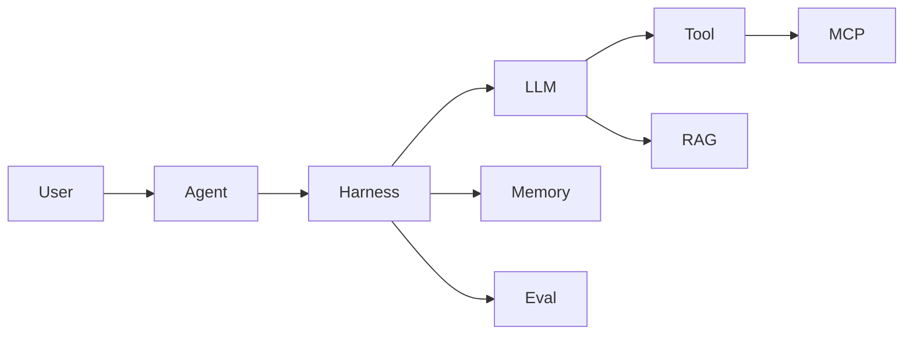
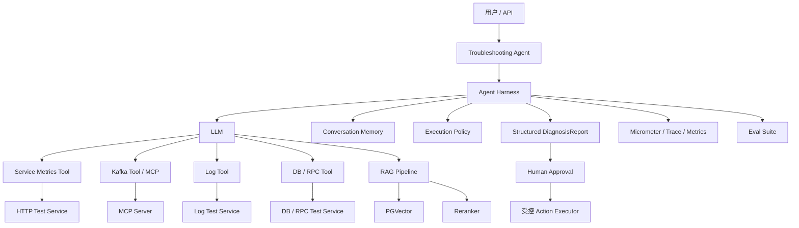
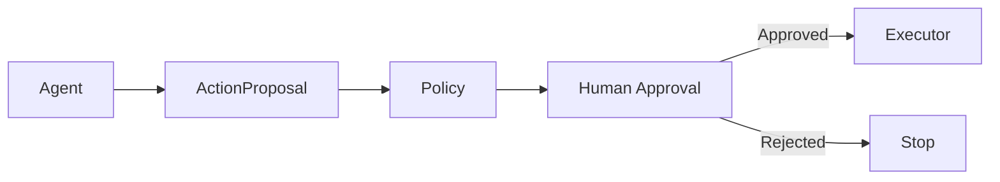

# Java 服务故障排查 Agent：14 天生产化进阶路线

> 适用对象：已完成 `java-troubleshooting-agent-quickstart.md` Day1～Day7，能够独立解释并实现 LLM、Tool Calling、Agent Loop、Harness、RAG、Memory、Eval 与 MCP。
>
> 技术主线：Java 17 + Spring Boot 4.x + Spring AI 2.0.x + Ollama / 可替换云模型 + PostgreSQL/PGVector + Micrometer + Testcontainers。
>
> 进阶目标：不再继续堆 Agent 概念，而是把现有学习型 Agent 升级为**可连接真实系统、可评测、可观测、可恢复、可审计、可部署的生产型 AI 应用**。
>
> 文档基线：2026-09；实际编码前仍应以 Spring AI 当前稳定版官方文档为准。

---

## 1. 为什么 Day7 之后不应立即学习 Multi-Agent

Day1～Day7 已经建立了完整的 Agent 概念闭环：



此时继续增加 Multi-Agent、Planner、Graph Workflow、多层 Reflection 或更多 MCP Server，很容易出现一个问题：

> 会的 AI 名词越来越多，但工程可靠性并没有同步提高。

接下来真正需要补的是：

```text
Mock Tool
    ↓
真实 API / 数据源
    ↓
失败与恢复
    ↓
持久化 RAG
    ↓
检索质量评测
    ↓
Observability
    ↓
Structured Output
    ↓
Security / Human Approval
    ↓
真实测试环境
    ↓
可重复回归
    ↓
可部署作品
```

因此第二阶段的核心不是“更多 Agent 技巧”，而是 **Production AI Engineering**。

---

## 2. 第二阶段最终目标

14 天完成后，现有 Java 故障排查 Agent 应演进为：



最终必须做到：

1. Tool 不再只依赖进程内 Mock；
2. 网络超时、5xx、限流、MCP 断连时能受控失败；
3. RAG 使用持久化向量库；
4. 检索质量有可量化指标；
5. Agent 全链路可观测；
6. 输出有稳定 JSON Contract；
7. 写操作必须经过 Human-in-the-loop；
8. 安全测试覆盖 Prompt Injection、越权、数据泄漏；
9. Eval 扩展为 30～50 个固定案例；
10. 可以通过 README、架构图和 Eval 报告展示整个项目。

---

## 3. 第二阶段刻意不做什么

| 暂不重点投入 | 原因 | 何时再做 |
|---|---|---|
| Multi-Agent | 当前单 Agent 可靠性还值得继续提升 | 单 Agent Eval 稳定后 |
| LangGraph / Graph Workflow | 容易先学 DSL，再丢失 Harness 本质 | 出现明显复杂工作流需求后 |
| Fine-tuning | 当前瓶颈主要在 Context、Tool、Eval、RAG | Prompt/RAG 无法解决稳定问题时 |
| 自训练 Embedding | 成本高，收益尚无评测依据 | Retrieval Eval 证明现模型不足时 |
| 大规模 Kubernetes 部署 | 目前重点是 AI 应用工程闭环 | 单机 Docker 化完成后 |
| 真生产写操作 | 风险过高 | Approval、RBAC、审计全部完成后 |
| 大量新 Tool | Tool 数量多不等于 Agent 更好 | Eval 证明存在必要信息缺口后 |
| “无限自主 Agent” | 不利于控制成本与安全 | 有明确业务场景再评估 |

原则：

> 每增加一个复杂组件，都必须能够通过 Eval 或工程指标说明它解决了什么问题。

---

## 4. 当前项目基线

完成 Day7 后，你应该已经具备：

| 能力 | 当前实现 |
|---|---|
| LLM 调用 | Spring AI `ChatModel` / `ChatClient` |
| Tool Calling | 本地 `@Tool` |
| Agent Loop | 手写 `AgentRunner` |
| Tool 执行 | `ToolCallingManager` |
| Harness | step、timeout、retry、policy、trace |
| RAG | Embedding + VectorStore + 自定义检索 |
| Hybrid Retrieval | Vector Candidate + Lexical / RRF |
| Memory | `ChatMemory` + `conversationId` |
| Eval | E01～E10 固定回归 |
| MCP | Kafka Tool LOCAL / MCP 对照 |
| 安全基础 | Tool 白名单、参数白名单、敏感信息处理 |
| 模型 | 本地 Ollama |
| Java | JDK 17 |

第二阶段不是推倒重写，而是继续在同一个项目上增量演进。

---

## 5. 第二阶段新增概念与代码映射

| 概念 | 建议实体 | 你必须理解的重点 |
|---|---|---|
| Tool Adapter | `ServiceMetricsClient` / `LogClient` | Tool 不应直接绑死底层 HTTP |
| Resilience | timeout / retry / circuit breaker | 哪些错误可重试，哪些不可重试 |
| Error Taxonomy | `ToolErrorType` | timeout、auth、5xx、invalid response 必须可区分 |
| Persistent Vector Store | `PgVectorStore` | 向量数据需要可持久化、可过滤 |
| Retrieval Eval | `RetrievalEvaluationIT` | RAG 不能只看最终回答 |
| Reranker | `DocumentReranker` | Candidate Retrieval 与 Final Ranking 分离 |
| Observability | Micrometer Observation | 模型、Tool、RAG、MCP 都要可追踪 |
| Structured Output | `DiagnosisReport` | Agent 输出必须能被系统消费 |
| Output Validation | `DiagnosisReportValidator` | JSON 合法不代表业务合法 |
| Human Approval | `ApprovalService` | 模型建议与真实执行必须隔离 |
| Prompt Injection Defense | `SecurityPolicy` | RAG 内容和用户输入都可能攻击 Agent |
| Model Portability | `ModelProfile` | 模型变化必须能用同一 Eval 比较 |
| Production Eval | 30～50 cases | 任何 Prompt/Tool/模型变更都必须回归 |

---

## 6. 推荐项目结构演进

```text
spring-ai-study/
├── pom.xml
├── doc/
│   ├── java-troubleshooting-agent-quickstart.md
│   └── java-troubleshooting-agent-advanced.md
│
├── src/main/java/org/example/ai/
│   ├── api/
│   ├── harness/
│   ├── tool/
│   │   ├── OpsTools.java
│   │   ├── AgentToolProvider.java
│   │   ├── client/
│   │   │   ├── ServiceMetricsClient.java
│   │   │   ├── KafkaStatusClient.java
│   │   │   ├── LogQueryClient.java
│   │   │   └── DependencyMetricsClient.java
│   │   ├── policy/
│   │   │   └── ToolAccessPolicy.java
│   │   └── dto/
│   │
│   ├── rag/
│   │   ├── KnowledgeLoader.java
│   │   ├── KnowledgeRetriever.java
│   │   ├── LexicalRrfRanker.java
│   │   └── rerank/
│   │       └── DocumentReranker.java
│   │
│   ├── diagnosis/
│   │   ├── DiagnosisReport.java
│   │   ├── DiagnosisStatus.java
│   │   └── DiagnosisReportValidator.java
│   │
│   ├── approval/
│   │   ├── ActionProposal.java
│   │   ├── ApprovalService.java
│   │   └── ActionExecutor.java
│   │
│   └── observability/
│       └── AgentObservationConvention.java
│
├── src/test/java/org/example/ai/
│   ├── eval/
│   │   ├── AgentEvaluationIT.java
│   │   ├── RetrievalEvaluationIT.java
│   │   ├── SecurityEvaluationIT.java
│   │   └── ModelComparisonIT.java
│   └── integration/
│
├── src/test/resources/
│   └── eval/
│       ├── agent-cases.yaml
│       ├── retrieval-cases.yaml
│       └── security-cases.yaml
│
└── test-services/
    ├── service-observer/
    ├── log-observer/
    └── dependency-observer/
```

仍然遵循：

> 主 Agent 持续增量演进，不每天创建一个新的 Agent Demo。

---

## 7. 14 天执行路线总览

| 天数 | 版本 | 核心任务 | 建议时间 | 当天核心理解 | 主要产物 |
|---|---|---|---:|---|---|
| Day 8 | V5 | Mock Tool → HTTP Tool | 3h | Tool Adapter、远程数据源 | HTTP Tool Client |
| Day 9 | V5.1 | Tool 失败与恢复 | 3h | Timeout、Retry、Error Taxonomy | Failure Matrix |
| Day 10 | V5.2 | 增加 DB / RPC 证据 | 3h | 跨组件证据链 | Dependency Tool |
| Day 11 | V6 | SimpleVectorStore → PGVector | 3～4h | 持久化 Vector Store | PGVector RAG |
| Day 12 | V6.1 | Retrieval Eval + Rerank | 4h | Recall@K、MRR、Ranking | Retrieval Report |
| Day 13 | V7 | Observability | 3h | Metrics、Tracing、Latency | Agent Trace |
| Day 14 | V7.1 | Structured Output | 3h | Stable Contract | `DiagnosisReport` |
| Day 15 | V7.2 | Output Validation + Retry | 3h | Validation、Repair | Output Guard |
| Day 16 | V8 | Human-in-the-loop | 3h | Suggest ≠ Execute | Approval Flow |
| Day 17 | V8.1 | Agent Security | 4h | Injection、RBAC、Leakage | Security Eval |
| Day 18 | V9 | 接入只读真实测试环境 | 4h | Production Data Contract | Real Tool |
| Day 19 | V9.1 | Eval 扩展到 30～50 Case | 4h | Regression Engineering | Eval Dataset |
| Day 20 | V9.2 | Manual Loop vs Advisor Loop | 3h | Framework Abstraction | A/B Report |
| Day 21 | V10 | 项目作品化 | 4h | Architecture Communication | README + Report |

每一天只引入一个主要变量，避免无法判断改动到底改善还是破坏了系统。

---

## 8. Day 8：V5 Mock Tool → HTTP Tool

### 目标

把 Tool 与进程内 Mock 解耦。

改造前：

```text
Agent → OpsTools → OpsMockDataProvider
```

改造后：

```text
Agent → OpsTools → ServiceMetricsClient → HTTP → Test Service
```

保留 Tool Schema，但内部改成 Client Adapter。

```java
interface ServiceMetricsClient {
    ServiceStatus getServiceStatus(String serviceName);
}
```

Tool 不应同时承担 URL 拼接、HTTP、鉴权、重试、JSON 解析和业务转换。

### 必做实验

| 场景 | 预期 |
|---|---|
| HTTP 200 | Tool 正常返回 |
| Connection refused | Agent 不能编造指标 |
| 返回字段缺失 | 明确 Tool 数据不完整 |
| 返回超大 Payload | Harness 截断 |
| 错误 Content-Type | 作为 Tool failure 处理 |

### 验收

- [x] Agent 的 Tool Schema 没变化；
- [x] Mock 数据不再直接存在于 Tool 方法；
- [x] HTTP Server 停止时 Agent 能受控结束；
- [x] Tool failure 会出现在 Trace；
- [x] Day6 Eval 中不受 HTTP 行为影响的案例仍能通过。

---

## 9. Day 9：V5.1 Tool 失败与恢复

### 目标

把简单的“成功 / 失败”升级为 Tool failure taxonomy：

```text
TIMEOUT
CONNECTION_FAILURE
AUTH_FAILURE
RATE_LIMITED
SERVER_ERROR
INVALID_RESPONSE
POLICY_REJECTED
UNKNOWN
```

### 推荐规则

| 错误 | 是否重试 | Agent 应如何理解 |
|---|---:|---|
| Timeout | 1 次 | 数据暂不可用 |
| Connect Failure | 1 次 | 下游不可达 |
| HTTP 429 | 有 Retry-After 时遵守 | 当前受限 |
| HTTP 500/503 | 1 次 | 瞬时失败可能恢复 |
| HTTP 400 | 否 | Tool 参数问题 |
| HTTP 401/403 | 否 | 权限问题 |
| Invalid JSON | 否 | 返回契约异常 |
| Policy Rejected | 否 | 安全策略主动阻止 |

### 必做实验

1. 第一次 503，第二次 200，确认 retry 后恢复；
2. 401，确认不重试；
3. timeout，确认失败进入 Trace；
4. invalid JSON，确认不会被当成“无数据”。

### 验收

- [x] retry 只针对可恢复错误；
- [x] 不会对权限错误盲目重试；
- [x] 每一次 retry 都进入 Trace；
- [x] 失败结果明确标记数据不可用，提示词禁止将缺失数据当作正常值（已验证模型上下文传递，真实模型行为仍需独立 Eval）。

实现、失败矩阵及测试结果见 [Day9 实验记录](experiments/day09-tool-failure.md)。

---

## 10. Day 10：V5.2 增加 DB / RPC 证据

### 目标

让故障排查不再只依赖 Service + Kafka + Log，增加一个统一的依赖指标 Tool。

建议：

```java
getDependencyStatus(serviceName)
```

第一版不要拆成十几个 Tool。

示例返回：

```json
{
  "database": {
    "p99Ms": 2500,
    "activeConnections": 49,
    "maxConnections": 50
  },
  "rpc": {
    "dependency": "payment-gateway",
    "p99Ms": 3200,
    "timeoutRate": 0.35
  }
}
```

### 必做场景

#### Case A：DB 慢

```text
Kafka consumeRate ↓
CPU 正常
线程池较高
DB P99 ↑
连接池接近满
```

#### Case B：RPC timeout

```text
Kafka consumeRate ↓
CPU 正常
RPC timeoutRate ↑
```

### 验收

- [x] E03 不再只靠日志文本判断 DB（真实模型 Eval 移除日志线索）；
- [x] E04 不再只靠日志文本判断 RPC（真实模型 Eval 移除日志线索）；
- [x] Agent 能形成服务、Kafka、DB/RPC 跨组件证据链；
- [x] 无对应实时证据时保留待验证假设（已通过固定真实模型案例，不代表所有输入的硬保证）。

实现、复现命令及验收边界见 [Day10 实验记录](experiments/day10-dependency-evidence.md)。

---

## 11. Day 11：V6 SimpleVectorStore → PGVector

### 目标

把学习用内存 VectorStore 换成持久化向量数据库。

Document metadata 至少包含：

```text
source
title
category
version
updatedAt
service
```

测试环境优先使用 本地虚拟机 PostgreSQL + pgvector。

```shell
# 启动 postgresql
systemctl start postgresql-15

# 登录 postgresql
sudo -u postgres psql

# 进入指定数据库
sudo -u postgres psql -d ai_learning

# 查看数据库
\l

# 退出登录
\q
```

```sql
# 确认 PostgreSQL 能发现 pgvector
SELECT name, default_version FROM pg_available_extensions WHERE name = 'vector';

# 创建用户
CREATE USER ai_user WITH PASSWORD '1234';

# 创建数据库
CREATE DATABASE ai_learning OWNER ai_user;

# 给 ai_learning 启用 pgvector、hstore、uuid-ossp
CREATE EXTENSION IF NOT EXISTS vector;
CREATE EXTENSION IF NOT EXISTS hstore;
CREATE EXTENSION IF NOT EXISTS "uuid-ossp";

# 验证 ai_learning 是否启用 pgvector
SELECT extname, extversion FROM pg_extension WHERE extname = 'vector';

# 创建数据表
CREATE TABLE document_vector (
    id BIGSERIAL PRIMARY KEY,
    content TEXT NOT NULL,
    embedding VECTOR(3)
);

# 插入数据
INSERT INTO document_vector(content, embedding) VALUES('Java 是一种编程语言', '[1,0,0]'),('Spring Boot 用于 Java 后端开发', '[0.9,0.1,0]'),('PostgreSQL 是关系型数据库', '[0.1,0.9,0]'),('苹果是一种水果', '[0,0,1]');

# 查询数据
SELECT * FROM document_vector;
SELECT id, content,embedding <-> '[1,0,0]' AS distance FROM document_vector ORDER BY embedding <-> '[1,0,0]' LIMIT 3;

# 创建 HNSW 索引
CREATE INDEX document_vector_embedding_hnsw ON document_vector USING hnsw (embedding vector_cosine_ops);
```

### 必做实验

1. 写入知识文档；
2. 重启应用；
3. 不重新 Embedding；
4. 查询仍然能够命中知识；
5. 验证 metadata filter。

### 验收

- [x] 重启后向量数据仍存在（销毁并重建整个应用上下文与连接池，23 个块复用，文档 Embedding 为 0）；
- [x] metadata filter 可以工作；
- [x] 测试环境不依赖手工数据库状态（已配置虚拟机与扩展，测试自行创建和清理隔离 schema）；
- [x] 能说明 SimpleVectorStore 为什么不适合生产。

实现、官方依据及验收边界见 [Day11 实验记录](experiments/day11-pgvector.md)。

---

## 12. Day 12：V6.1 Retrieval Eval + Reranker

### 目标

不要再通过最终回答“看起来不错”评价 RAG。

建立独立 Retrieval Dataset：

| Query | Expected Source |
|---|---|
| 执行器没有空闲线程 | `thread-pool-exhaustion.md` |
| 消费速度赶不上生产速度 | `kafka-consumer-lag.md` |
| DB P99 暴涨 | `mysql-slow-query.md` |
| 连接池接近满 | `mysql-slow-query.md` |

至少记录：

```text
Recall@1
Recall@3
MRR
```

当前已有 Vector + Lexical / RRF 后，不重复实现 Hybrid Search，而是演进为：

```text
Query
  ↓
Hybrid Candidate Retrieval
  ↓
Top 20
  ↓
Reranker
  ↓
Top 3
  ↓
Context
```

建议定义：

```java
interface DocumentReranker {
    List<RetrievedChunk> rerank(
        String query,
        List<RetrievedChunk> candidates,
        int topK
    );
}
```

### 必做 A/B

```text
A: Vector only
B: Vector + RRF
C: Vector + RRF + Rerank
```

比较：

```text
Recall@3
MRR
Latency
```

### 验收

- [x] RAG 有独立 Eval（18 条固定查询，开发/验证分组）；
- [x] 不依赖最终 LLM 回答评估召回质量（真实 PGVector + BGE-M3）；
- [x] Reranker 有可量化收益或被证明无收益（MRR 改善但验证集 Recall@3 退化，保留完整对照）；
- [x] 参数变化必须由数据决定（保留默认 HYBRID、Top3、阈值 0.47，不默认启用存在覆盖率退化的重排）。

实现、官方依据、A/B/C 实测与子 Agent 验收见 [Day12 实验记录](experiments/day12-retrieval-evaluation.md)。

---

## 13. Day 13：V7 Observability

### 目标

保留 `TraceRecorder`，同时接入标准 Observability。

目标 Trace：

```text
Agent Request
│
├── Retrieval
├── Model Call #1
├── Tool Call
├── Model Call #2
├── MCP Call
├── Model Call #3
└── Final Response
```

### 最低指标

#### Agent

```text
agent.requests
agent.failures
agent.latency
agent.steps
agent.tool.calls
agent.policy.rejects
```

#### LLM

```text
llm.request.latency
llm.prompt.tokens
llm.completion.tokens
```

#### Tool

```text
tool.calls
tool.failures
tool.timeout
tool.retry
tool.latency
```

#### RAG

```text
rag.retrieve.latency
rag.candidate.count
rag.final.count
```

#### MCP

```text
mcp.calls
mcp.failure
mcp.latency
```

### 必做实验

跑固定 Eval，输出：

```text
P50/P95 latency
平均 Step
平均 Tool Call
失败率
Token
```

### 验收

- [x] 一次 Agent 请求能够串起完整 Trace（含线程池上下文与真实 MCP 客户端调用）；
- [x] 能定位最耗时的是 LLM、Tool 还是 Retrieval（固定三例模型调用占比 99.33%）；
- [x] Metric 中不出现 API Key、原始敏感日志（固定低基数标签，PGVector Span 移除查询正文）；
- [x] 能解释 `TraceRecorder` 与 Micrometer 的职责差异。

实现、官方依据、真实评测与子 Agent 验收见 [Day13 实验记录](experiments/day13-observability.md)。

---

## 14. Day 14：V7.1 Structured Output

### 目标

最终结果不再主要依赖 Markdown 文本。

定义：

```java
public record DiagnosisReport(
        DiagnosisStatus status,
        String summary,
        List<Fact> facts,
        List<Hypothesis> hypotheses,
        List<NextAction> nextActions,
        List<String> missingInformation
) {
}
```

推荐：

```java
public record Fact(
        String statement,
        String source
) {
}

public record Hypothesis(
        String cause,
        double confidence,
        List<String> evidence
) {
}
```

### Eval 改造

E01 不再主要依赖：

```text
answer contains "线程池饱和"
```

而是优先断言结构化字段。

### 验收

- [ ] Controller 返回稳定 JSON；
- [ ] Eval 开始使用结构化字段；
- [ ] 字段缺失不会被静默忽略；
- [ ] 自然语言只是展示层，不再是系统内部唯一 Contract。

---

## 15. Day 15：V7.2 Output Validation + Repair

### 目标

理解：

> JSON 能反序列化，不代表业务结果合法。

至少检查：

```text
confidence ∈ [0,1]
DIAGNOSED 必须存在 evidence
facts 中的实时指标必须可追溯
missingInformation 与已有事实不冲突
source 必须真实存在
```

流程：

```text
LLM
 ↓
Structured Output
 ↓
Validator
 ├─ PASS → return
 └─ FAIL → Repair Prompt → Retry 1 次
```

禁止无限 repair。

### 验收

- [ ] 格式错误可以恢复；
- [ ] 业务错误能被 Validator 发现；
- [ ] repair 最大次数受限；
- [ ] repair 同样进入 Trace / Eval。

---

## 16. Day 16：V8 Human-in-the-loop

### 目标

首次引入可能产生副作用的动作，但默认不真正执行。

正确结构：



示例：

```json
{
  "action": "SCALE_CONSUMER",
  "target": "order-topic",
  "arguments": {
    "replicas": 6
  },
  "reason": "消费速率持续低于生产速率",
  "risk": "MEDIUM",
  "approvalRequired": true
}
```

第一版 Executor 只输出：

```text
SIMULATED_EXECUTION
```

### 验收

- [ ] LLM 无法绕过 Approval；
- [ ] rejected action 不会进入 Executor；
- [ ] proposal 与 execution 分离；
- [ ] 所有审批有 audit record。

---

## 17. Day 17：V8.1 Agent Security

### 目标

把安全从“代码里有白名单”升级成正式测试集。

### Security Eval Cases

至少覆盖：

1. Prompt Injection；
2. RAG Injection；
3. Tool 越权；
4. MCP 越权；
5. 数据泄漏；
6. Approval Bypass。

安全原则：

```text
Prompt 是软约束
Policy 是硬约束
```

### 验收

- [ ] Prompt Injection 不能突破 Java Policy；
- [ ] RAG 内容不能获得系统权限；
- [ ] 敏感内容不会进入日志；
- [ ] Approval 不能被自然语言绕过；
- [ ] Security Eval 可一键运行。

---

## 18. Day 18：V9 接入只读真实测试环境

### 目标

把当前项目真正连接到一个安全的测试环境。

建议优先连接：

```text
本地 Docker / 测试 Kafka
测试 PostgreSQL
测试 HTTP 服务
测试日志文件或日志 API
```

仍然坚持：

```text
read-only first
```

### 验收

- [ ] Agent 至少读取一个真实系统状态；
- [ ] Tool 返回不依赖固定 Mock；
- [ ] 真实系统不可达时能降级；
- [ ] 不获得任何生产写权限；
- [ ] Eval 测试与真实环境测试明确分离。

---

## 19. Day 19：V9.1 Eval 扩展到 30～50 Case

### 目标

把 Eval 从学习 Demo 升级为 Regression Dataset。

推荐分布：

| 类型 | 数量 |
|---|---:|
| 正常故障 | 10 |
| 无异常 | 5 |
| 组合故障 | 5 |
| Tool Failure | 5 |
| RAG Failure | 5 |
| Memory | 5 |
| Security | 5 |
| 合计 | 40 |

### 指标

```text
Root Cause Accuracy
Unsupported Claim Rate
Structured Output Valid Rate
Tool Selection Precision
Tool Selection Recall
Argument Accuracy
Unnecessary Tool Calls
Recall@K
MRR
Citation Correctness
Average Steps
Step Limit Hit Rate
Retry Rate
Timeout Rate
P50 / P95 Latency
Prompt Tokens
Completion Tokens
```

### 基线策略

每次改动以下任意内容都必须跑回归：

```text
Prompt
Tool description
模型
Embedding
Retriever
Reranker
Memory
MCP
Harness
```

### 验收

- [ ] 至少 30 case；
- [ ] 结果保存 JSON；
- [ ] 可比较两个版本；
- [ ] 失败案例能定位到 trajectory；
- [ ] 不再用“感觉模型更聪明”做技术决策。

---

## 20. Day 20：V9.2 Manual Loop vs Advisor Loop

### 目标

保留 `ManualAgentRunner`，再使用 Spring AI 高层抽象实现 `AdvisorAgentRunner`。

### 对照维度

| 指标 | Manual | Advisor |
|---|---:|---:|
| E01～E10 Pass | | |
| Avg Steps | | |
| Tool Calls | | |
| P95 Latency | | |
| 可定制 Policy | | |
| Trace 粒度 | | |
| 代码量 | | |

### 必须回答

1. Spring AI 自动 Tool Loop 帮你做了什么？
2. 手写 Loop 为什么仍然有学习价值？
3. 什么时候应该使用框架高层抽象？
4. 什么时候业务 Harness 需要自己控制循环？
5. Advisor 是 Agent 吗？
6. `ToolCallingAdvisor` 与 `ToolCallingManager` 的职责区别是什么？

### 验收

- [ ] 两种实现可以跑同一 Eval；
- [ ] 核心行为无明显退化；
- [ ] 能根据工程需求选择抽象层，而不是只会一种写法。

---

## 21. Day 21：V10 项目作品化

### 目标

把仓库从“学习代码”变成别人 10 分钟能够理解的工程作品。

README 至少包含：

1. 项目一句话说明；
2. Architecture；
3. 一次真实 trajectory；
4. Eval Report；
5. Failure Demo；
6. Security 设计；
7. 启动方式；
8. 依赖组件；
9. 已知限制。

### 最终验收

- [ ] 新人可按 README 独立启动；
- [ ] 架构图与实际代码一致；
- [ ] Eval 可重复运行；
- [ ] 失败演示可复现；
- [ ] 没有硬编码密钥；
- [ ] README 不夸大项目能力；
- [ ] 能用于简历和面试演示。

---

## 22. 第二阶段最终验收标准

### 22.1 Agent 正确性

- [ ] 30～50 个固定 Case；
- [ ] 主要故障判断准确率 ≥ 85%；
- [ ] 无异常 Case 不虚构故障；
- [ ] 实时数值 100% 可追溯；
- [ ] 不伪造知识来源；
- [ ] 最大步数限制 100% 生效。

### 22.2 Tool Reliability

- [ ] HTTP timeout 可恢复；
- [ ] 5xx 可按策略 retry；
- [ ] 401/403 不盲目 retry；
- [ ] MCP Down 受控失败；
- [ ] 超大 Result 会截断；
- [ ] Tool Error 有明确分类。

### 22.3 RAG

- [ ] VectorStore 持久化；
- [ ] Retrieval Dataset ≥ 20；
- [ ] 记录 Recall@1 / Recall@3 / MRR；
- [ ] Rerank 前后有 A/B 数据；
- [ ] metadata filter 生效。

### 22.4 Security

- [ ] 越权 Tool 100% 拒绝；
- [ ] Prompt Injection 无法突破 Policy；
- [ ] RAG Injection 无法触发写操作；
- [ ] 敏感数据不进入日志；
- [ ] 所有副作用操作必须 Approval。

### 22.5 Observability

- [ ] Agent request 有完整 trace；
- [ ] 能统计 LLM / Tool / RAG / MCP latency；
- [ ] Token 可统计；
- [ ] P95 可计算；
- [ ] retry / timeout / reject 有 Metric。

### 22.6 Maintainability

- [ ] Tool Contract 与底层 Client 解耦；
- [ ] Model 可替换；
- [ ] VectorStore 可替换；
- [ ] MCP 与 Local Tool 可 A/B；
- [ ] Manual / Advisor Loop 可通过相同 Eval 验证。

---

## 23. 推荐学习顺序背后的逻辑

### 第一阶段：Day8～Day10

解决：

> Agent 是否真的能可靠地连接企业系统？

重点：API Integration、Failure Handling、Evidence Chain。

### 第二阶段：Day11～Day12

解决：

> RAG 是否真的检索到了正确知识？

重点：Persistent Retrieval、Retrieval Evaluation、Reranking。

### 第三阶段：Day13～Day15

解决：

> Agent 是否可观察、可集成、可验证？

重点：Observability、Structured Output、Validation。

### 第四阶段：Day16～Day18

解决：

> Agent 是否能安全地进入真实业务环境？

重点：Human Approval、Security、Real Environment。

### 第五阶段：Day19～Day21

解决：

> 如何证明 Agent 的质量，并把能力展示出来？

重点：Regression Eval、Framework Comparison、Portfolio。

---

## 24. 每天统一的学习方式

每一天都遵守：

```text
先定义问题
↓
写失败 Case
↓
实现最小功能
↓
跑对照实验
↓
记录指标
↓
写结论
```

不要采用：

```text
看到一个新 API
↓
复制 Demo
↓
能启动
↓
认为学会了
```

### 每天结束必须回答 5 个问题

1. 今天新增的组件解决什么问题？
2. 没有它时，系统具体会出现什么失败？
3. 它属于 Model、Context、Tool、Harness、Data 还是 Infrastructure？
4. 如何通过 Eval 证明它产生了正收益？
5. 如果它失败，系统如何降级？

回答不了，就说明更多是在“用了 API”，还没有真正掌握。

---

## 25. 建议维护一份实验日志

建议新增：

```text
doc/experiments/
├── day08-http-tool.md
├── day09-tool-failure.md
├── day12-rerank-ab.md
├── day13-observability.md
├── day17-security.md
└── day20-advisor-vs-manual.md
```

统一模板：

```markdown
# Experiment

## Hypothesis

## Baseline

## Change

## Dataset

## Metrics

## Result

## Unexpected Behavior

## Conclusion

## Keep / Revert
```

目的：

> 把“学习过程”变成可解释的工程决策记录。

---

## 26. 下一阶段应重点掌握的 Spring AI 能力

优先掌握：

```text
ChatClient
ChatModel
Advisor
Tool Calling
ToolCallingManager
ToolCallingAdvisor
Structured Output
ChatMemory
VectorStore
PGVector
RAG
Evaluator
Observability
MCP Client / Server
```

每一个 API 都应先回答：

> 它位于整个 Agent Runtime 的哪一层？

而不是记方法名。

---

## 27. Python 学习安排

第二阶段 Java 仍然是主线。

建议投入：

```text
Java / Spring AI       70%
AI / LLM Engineering  20%
Python                 10%
```

Python 目标：

- 能看懂 Notebook；
- 能运行 Hugging Face / Transformers 示例；
- 能理解主流 Agent / RAG Python 示例；
- 能用 Python 快速做数据分析和 Eval；
- 能把有价值的思想迁移回 Java。

暂时不需要大量学习 Django、Flask Web Engineering 或深度学习训练框架内部实现。

---

## 28. 什么时候开始 Multi-Agent

只有满足下面条件后才建议进入：

- [ ] 单 Agent ≥ 30 个 Eval；
- [ ] Tool 选择已经比较稳定；
- [ ] RAG 有 Retrieval Eval；
- [ ] 所有 Tool 有 timeout / retry / policy；
- [ ] 有完整 trace；
- [ ] 有 Human Approval；
- [ ] 能明确指出“单 Agent 无法很好解决”的具体问题。

这时再考虑：

```text
Coordinator
    ↓
Kafka Agent
DB Agent
Service Agent
Log Agent
    ↓
Reviewer
```

并回答：

> Multi-Agent 带来的收益是否高于额外的路由、Token、状态和 Debug 成本？

如果不能证明，不拆。

---

## 29. 完成第二阶段后你应达到的能力

完成 Day21 后，你应该可以独立解释：

> 一个生产型 AI Agent 并不是“LLM 加几个 Tool”。它需要可靠的数据接入、明确的 Tool Contract、可控的 Agent Loop、Context 与 Memory 管理、可评测的 RAG、错误分类与恢复、结构化输出、硬安全边界、Human Approval、Observability 和持续 Regression Eval。MCP 解决能力标准化接入，LLM 负责推理，但系统可靠性仍主要来自模型外部的工程 Harness。

同时，你应该能够从 Java 后端工程师的角度设计：

```text
AI Application
=
Model
+ Context
+ Data
+ Tools
+ Harness
+ Policy
+ Eval
+ Observability
+ Infrastructure
```

---

## 30. 推荐官方资料

学习过程中优先查官方文档，不优先依赖博客中的旧版本 API。

- Spring AI Reference：https://docs.spring.io/spring-ai/reference/
- Tool Calling：https://docs.spring.io/spring-ai/reference/api/tools.html
- Advisors：https://docs.spring.io/spring-ai/reference/api/advisors.html
- RAG：https://docs.spring.io/spring-ai/reference/api/retrieval-augmented-generation.html
- Vector Databases：https://docs.spring.io/spring-ai/reference/api/vectordbs.html
- PGVector：https://docs.spring.io/spring-ai/reference/api/vectordbs/pgvector.html
- Evaluation：https://docs.spring.io/spring-ai/reference/api/testing.html
- Observability：https://docs.spring.io/spring-ai/reference/observability/
- MCP：https://docs.spring.io/spring-ai/reference/api/mcp/mcp-overview.html

---

## 31. 最终学习路线

```text
第一阶段：理解 Agent
────────────────────────
Day1   LLM
Day2   Tool Calling
Day3   Agent Loop + Harness
Day4   RAG
Day5   Memory + Safety
Day6   Eval
Day7   MCP

第二阶段：生产化 Agent
────────────────────────
Day8   Real HTTP Tool
Day9   Resilience
Day10  Cross-system Evidence
Day11  PGVector
Day12  Retrieval Eval + Rerank
Day13  Observability
Day14  Structured Output
Day15  Validation + Repair
Day16  Human Approval
Day17  Security
Day18  Real Test Environment
Day19  Regression Eval
Day20  Manual vs Advisor
Day21  Portfolio

第三阶段：按真实需求选择
────────────────────────
Multi-Agent
Workflow / Graph
A2A
Advanced Planning
Long-running Agent
Fine-tuning
Production Deployment
```

第二阶段完成之前，**不以增加更多 Agent 概念为目标**。

目标始终是：

> 让现有 Agent 更可靠、更可解释、更可测量、更安全、更接近真实企业系统。
