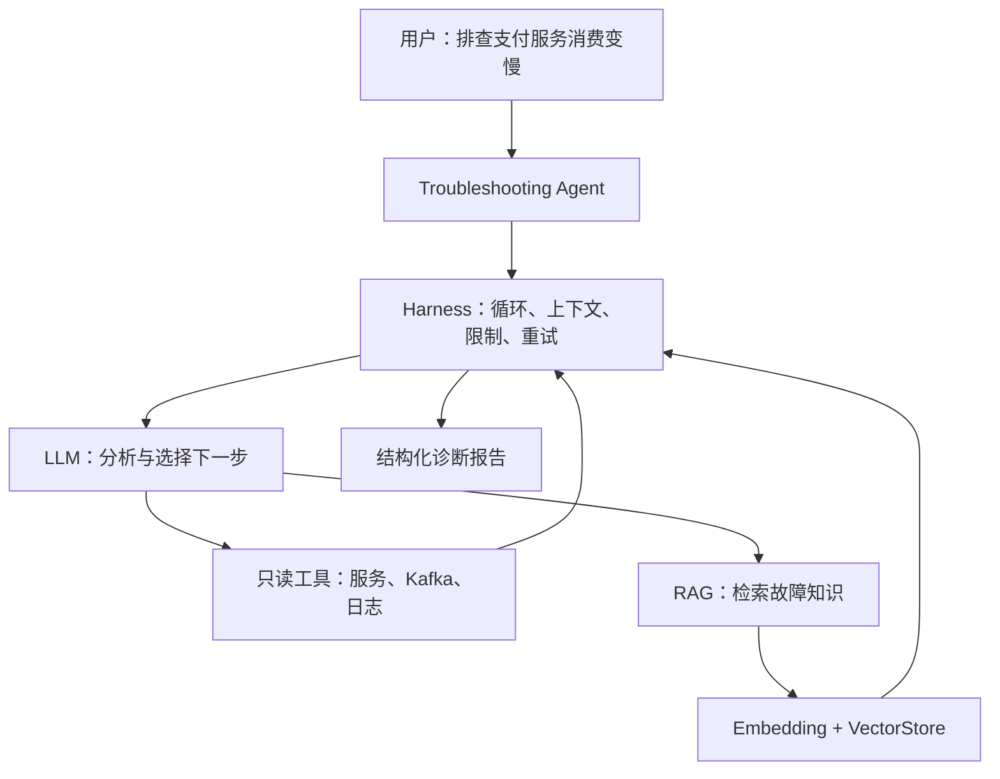
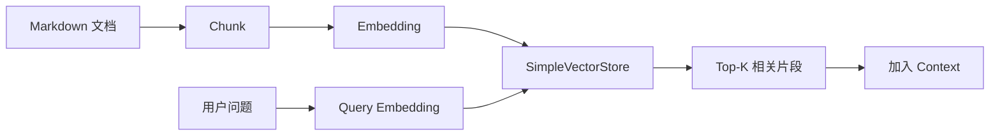
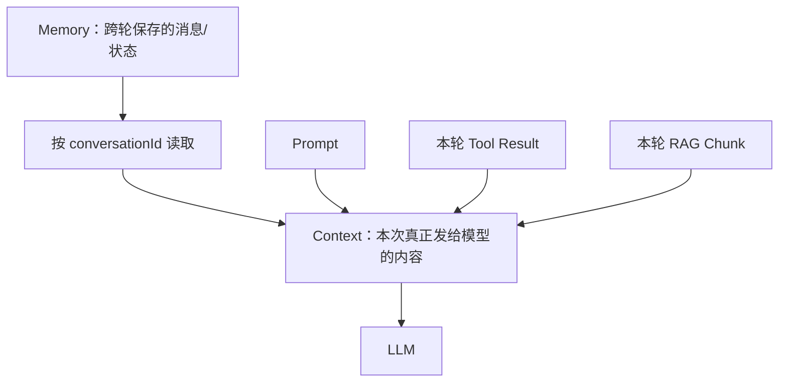

# Java 服务故障排查 Agent：7 天快速上手路线

> 适用对象：具备 3～4 年 Java / Spring Boot 后端经验，希望快速理解 AI 应用与 Agent 开发核心概念。  
> 技术主线：Java 17 + Spring Boot 4.x + Spring AI 2.0.x + Ollama + Markdown 知识库。  
> 文档基线：2026-09-13；开始编码前请以 Spring AI 官方文档的当前稳定版本为准。

---

## 1. 最终目标

用一个连续迭代的小项目实现如下能力：



最终输入示例：

```text
payment-service 的 order-topic 消费变慢，请排查原因。
```

最终输出必须包含：

1. 已观察到的事实；
2. 根因判断及置信度；
3. 推理所依据的工具结果和知识条目；
4. 建议的下一步操作；
5. 当前信息不足时，明确还需要什么，而不是编造结论。

### 学完后的验收标准

你应当能够不看资料解释下面这句话，并能在项目中指出每部分代码的位置：

> LLM 负责分析和决策，Tool 负责读取真实环境，Embedding 负责语义检索，RAG 负责把外部知识加入 Context，Memory 负责跨轮保存必要状态，Harness 负责组织循环、边界与恢复，Agent 是整套系统围绕目标运行起来后的形态，MCP 则让工具以标准协议被远程发现和调用。

---

## 2. 范围控制：第一版刻意不做什么

| 暂不实现 | 原因 | 何时再加 |
|---|---|---|
| 前端 UI | 不帮助理解 Agent 核心 | REST API 稳定后 |
| 真实生产系统写操作 | 学习阶段风险过高 | 完成权限和审批机制后 |
| PostgreSQL / Milvus | 会把注意力带到基础设施 | SimpleVectorStore 跑通后 |
| Docker / Kubernetes | 与第一阶段概念无直接关系 | 需要部署时 |
| Multi-Agent | 增加路由与状态复杂度 | 单 Agent 可评测后 |
| LangGraph 等工作流框架 | 容易先学 API、后懂原理 | 手写一次 Agent Loop 后 |
| 大量 Tools | 三个只读工具已足够观察循环 | 出现真实工具选择问题后 |

第一版的三个 Tool 全部返回固定 Mock 数据，不连接真实 Kafka、日志平台或生产服务。

---

## 3. 概念与项目代码的对应关系

| 概念 | 在本项目中的实体 | 你必须观察的现象 |
|---|---|---|
| LLM | OpenAI Chat Model | 不接工具时，只能基于已有知识回答，拿不到实时指标 |
| Prompt | 故障排查系统指令 | 约束先收集证据、后给结论，禁止编造指标 |
| Tool Calling | `OpsTools` 中的三个只读方法 | 模型生成工具名与参数，Java 执行后返回结果 |
| Observation | Tool 返回的 JSON / DTO | 结果重新进入上下文，影响模型的下一步 |
| Agent Loop | LLM → Tool → LLM 的循环 | 一次用户请求可能触发多次模型和工具调用 |
| Harness | `AgentRunner`、Advisor、限制与日志 | 控制最大步数、超时、重试、权限和停止条件 |
| Context | 当前一次模型调用实际收到的消息 | Prompt、历史消息、工具结果、RAG 片段都可能进入其中 |
| Embedding | `EmbeddingModel` | 同义表达也能命中同一篇故障文档 |
| VectorStore | `SimpleVectorStore` | 保存文档 Chunk 的向量并做相似度检索 |
| RAG | `QuestionAnswerAdvisor` 或自定义检索 | 把相关故障手册片段加入本次 Context |
| Memory | `ChatMemory` + `conversationId` | 下一轮能理解“刚才那个服务”指什么 |
| MCP | 将一个本地 Tool 拆成 MCP Server | Agent 使用能力的方式基本不变，但调用跨进程 |
| Eval | 固定故障案例和断言 | 用同一组案例比较不同版本，而非凭感觉评估 |

---

## 4. 推荐项目结构

```text
java-troubleshooting-agent/
├── pom.xml
├── src/main/java/com/example/opsagent/
│   ├── OpsAgentApplication.java
│   ├── agent/
│   │   ├── TroubleshootingAgent.java
│   │   └── DiagnosisReport.java
│   ├── api/
│   │   └── TroubleshootingController.java
│   ├── config/
│   │   └── AiConfig.java
│   ├── harness/
│   │   ├── AgentRunner.java
│   │   ├── ExecutionPolicy.java
│   │   └── TraceRecorder.java
│   ├── tool/
│   │   ├── OpsTools.java
│   │   └── dto/
│   └── rag/
│       └── KnowledgeLoader.java
├── src/main/resources/
│   ├── application.yml
│   └── knowledge/
│       ├── kafka-consumer-lag.md
│       ├── thread-pool-exhaustion.md
│       └── mysql-slow-query.md
└── src/test/
    ├── java/com/example/opsagent/
    │   └── AgentEvaluationTest.java
    └── resources/eval-cases.yaml
```

所有阶段都在这个项目上增量修改，不要每天新建一个工程。

---

## 5. 环境准备（Day 0，约 1 小时）

### 5.1 技术基线

| 项目 | 建议 |
|---|---|
| JDK | Java 21 |
| 构建工具 | Maven 3.9+ |
| Spring Boot | 4.0.x 或 4.1.x，与当前 Spring AI 2.0.x 兼容 |
| Spring AI | 当前稳定版；本文编写时官方文档显示 2.0.1 |
| 模型 | 账户当前可用、支持 Tool Calling 的 OpenAI Chat Model |
| Embedding | 账户当前可用的 OpenAI Embedding Model |
| API | Spring Web REST |

建议直接从 [Spring Initializr](https://start.spring.io/) 创建项目，先选 Spring Web 和 OpenAI Model；RAG 相关依赖到 Day 4 再加入。

### 5.2 最小配置原则

```yaml
spring:
  ai:
    openai:
      api-key: ${OPENAI_API_KEY}
```

- API Key 只从环境变量读取，禁止提交到 Git。
- 第一周固定模型和参数，避免模型变化干扰版本对比。
- Prompt、Tool 输入输出、每一步耗时都记录，但不要记录密钥或敏感生产数据。

### 5.3 Day 0 验收

- [ ] `mvn test` 能通过；
- [ ] 应用可启动；
- [ ] API Key 未写入仓库；
- [ ] 能完成一次最简单的模型调用。

---

## 6. 7 天执行路线总览

| 天数 | 版本 | 核心任务 | 预计时间 | 主要理解的概念 | 当天产物 |
|---|---|---|---:|---|---|
| Day 1 | V0 | 普通问答接口 | 2h | LLM、Prompt、Context | `/api/chat` |
| Day 2 | V1 | 加入三个 Mock Tool | 3h | Tool Calling、Observation | 可自主读取指标的 Agent |
| Day 3 | V1.5 | 观察并手写一次循环 | 3h | Agent Loop、Harness | `AgentRunner` + Trace |
| Day 4 | V2 | 加入 Embedding 与 RAG | 3h | Chunk、向量检索、RAG | 三篇知识文档 + 检索日志 |
| Day 5 | V3 | 加入 Memory 与安全边界 | 3h | State、Context、Retry、Permission | 多轮排查 + 执行策略 |
| Day 6 | V3.5 | 建立 Eval | 3h | 可重复评测、回归 | 8～10 个固定案例 |
| Day 7 | V4 | 拆出一个 MCP Tool | 3～4h | MCP Client / Server、工具标准化 | 一个最小 MCP Server |

每天只完成当天的“最小闭环”。卡住超过 30 分钟时，先用固定返回值缩小问题，不要顺手引入新框架。

---

## 7. Day 1：V0 普通 LLM Chat

### 目标

只实现：

```text
User → ChatClient → LLM → Answer
```

接口：

```http
POST /api/chat
Content-Type: application/json

{"message":"Kafka Consumer Lag 是什么意思？"}
```

系统 Prompt 先保持简短：

```text
你是一名 Java 生产故障排查助手。
区分“已知事实、推测、待验证项”；不知道实时状态时必须明确说明，不得编造指标。
回答应包含：判断、依据、下一步。
```

### 必做实验

连续问两个问题：

1. “Kafka Consumer Lag 是什么意思？”
2. “payment-service 现在的 Lag 是多少？”

观察模型为何能回答第一个，却无法可靠回答第二个。

### 你应理解

- LLM 是通用推理能力，不是生产监控系统。
- Prompt 是输入的一部分，不等于 Agent。
- Context 是模型本次真正看到的内容，不等于所有可用数据。

### 验收

- [ ] REST 请求可得到回答；
- [ ] 回答第二个问题时不会伪造实时数值；
- [ ] 你能打印本次请求的输入、输出、耗时和 Token 使用量。

---

## 8. Day 2：V1 加入三个只读 Tool

### 目标

实现三个返回 Mock 数据的 Java 方法：

```java
class OpsTools {

    @Tool(description = "查询指定服务的 CPU、内存、线程池与实例健康状态")
    ServiceStatus getServiceStatus(String serviceName) { /* Mock */ }

    @Tool(description = "查询指定 Kafka Topic 的 Lag、生产速率、消费速率和消费者数量")
    KafkaStatus getKafkaStatus(String topic) { /* Mock */ }

    @Tool(description = "查询指定服务最近一段时间的错误日志摘要")
    List<ErrorLog> queryErrorLogs(String serviceName, int minutes) { /* Mock */ }
}
```

建议固定一组有关联的数据：

```json
{
  "kafka": {
    "topic": "order-topic",
    "lag": 125000,
    "produceRate": 5000,
    "consumeRate": 2800,
    "consumerCount": 3
  },
  "service": {
    "name": "payment-service",
    "cpuPercent": 96,
    "threadPoolActive": 200,
    "threadPoolMax": 200
  },
  "logs": [
    "TaskRejectedException: executor queue is full",
    "downstream timeout rate=18%"
  ]
}
```

### Tool 设计规则

| 规则 | 原因 |
|---|---|
| 名称表达动作，如 `getKafkaStatus` | 帮助模型选择正确工具 |
| 描述写清用途和边界 | Tool 描述本身会进入模型上下文 |
| 参数少而明确 | 减少错误调用 |
| 返回结构化 DTO | 比拼接字符串更容易分析、记录和断言 |
| 错误也结构化返回 | 让模型区分“无数据”和“工具失败” |
| 第一版全部只读 | 避免误操作 |

### 必做实验

问：

```text
payment-service 的 order-topic 消费变慢，请排查。
```

记录完整轨迹：

| Step | 模型/工具动作 | 输入 | 输出 |
|---:|---|---|---|
| 1 | LLM 决定调用工具 | 用户问题 + Tool Schema | `getKafkaStatus(order-topic)` |
| 2 | Kafka Tool | `order-topic` | Lag 与速率数据 |
| 3 | LLM 再决策 | 原问题 + Kafka Observation | `getServiceStatus(payment-service)` |
| 4 | Service Tool | `payment-service` | CPU 与线程池数据 |
| 5 | LLM 再决策 | 前述全部 Context | 可能调用日志 Tool 或给出判断 |

### 对照实验

临时移除 `OpsTools`，再问同一个问题。比较“有工具”和“无工具”的事实依据差异。

### 验收

- [x] 模型至少自主选择过一个 Tool，而不是 Controller 写死调用顺序；
- [x] 最终回答引用真实的 Mock 数值；
- [x] 模型不会声称执行了未发生的 Tool；
- [x] 能区分 Tool Call、Tool Result 和最终自然语言回答。

---

## 9. Day 3：V1.5 看懂 Agent Loop 与 Harness

### 目标

先观察 Spring AI 的自动 Tool Calling 循环，再自己实现一次等价的低层循环。手写部分以理解为主，不追求生产完整度。

概念伪代码：

```java
for (int step = 1; step <= maxSteps; step++) {
    ModelResponse response = llm.call(context);
    trace.recordModelResponse(step, response);

    if (!response.hasToolCalls()) {
        return response.finalText();
    }

    for (ToolCall call : response.toolCalls()) {
        permissionPolicy.check(call);
        Object result = toolExecutor.executeWithTimeout(call);
        context.addToolCall(call);
        context.addToolResult(call.id(), result);
        trace.recordToolResult(step, call, result);
    }
}
throw new StepLimitExceededException(maxSteps);
```

> 这是帮助理解结构的伪代码，不是可直接复制的 Spring AI API。真正实现时，按当前版本的 `ChatModel`、`ToolCallingManager` 与消息类型调整。

### Harness 最小职责

| 职责 | 第一版实现 |
|---|---|
| 循环控制 | `maxSteps = 6` |
| 工具权限 | 只允许三个白名单只读 Tool |
| 参数校验 | service/topic 必须在允许列表中 |
| 超时 | 单 Tool 3 秒 |
| 重试 | 只对明确的瞬时错误重试 1 次 |
| 重复调用保护 | 同一参数连续调用同一 Tool 两次则停止并记录 |
| Trace | 记录 step、工具名、参数摘要、结果摘要、耗时 |
| 停止条件 | 无 Tool Call、达到步数上限、权限拒绝或不可恢复错误 |

### 三个关键实验

| 实验 | 改动 | 预期现象 |
|---|---|---|
| 步数限制 | `maxSteps` 从 6 改为 1 | Agent 可能来不及收集完整证据 |
| Tool 超时 | Kafka Tool 主动延迟 5 秒 | Harness 中断调用，并将失败事实交给 Agent |
| 重复调用 | 诱导模型重复查相同服务 | 去重策略应阻止无意义循环 |

### 你应理解

- Agent Loop 不是模型内部自动存在的神秘能力，而是模型外部程序维护的循环。
- Spring AI 是 AI 应用框架，提供 Harness 构件；你写的限制、权限、恢复和业务策略共同形成具体 Harness。
- Agent = 模型 + 工具 + 状态 + 循环 + 目标与策略，不等于一次 LLM 调用。

### 验收

- [x] 能画出一次真实请求的完整 trajectory；
- [x] 能说清每一步 Context 新增了什么；
- [x] Tool 超时或循环过长时，应用能受控结束；
- [x] Trace 能解释最终结论来自哪些事实。

---

## 10. Day 4：V2 加入 Embedding 与 RAG

### 目标

让 Agent 除了读取实时 Mock 数据，还能检索团队故障手册。



### 知识库最小内容

建立三篇 Markdown：

1. `kafka-consumer-lag.md`：Lag 的定义、排查顺序、生产速率和消费速率关系；
2. `thread-pool-exhaustion.md`：线程池饱和现象、常见原因、缓解措施；
3. `mysql-slow-query.md`：DB P95/P99、连接池、慢查询与上游线程堆积的关系。

每篇控制在 500～1000 字，标题和小节语义清楚。第一版可按 300～500 中文字符切块，保留少量重叠；重点不是调参，而是观察“文档如何变成可检索 Context”。

### 实现顺序

1. 文档读取为 `Document`；
2. 切分为 Chunk，并添加 `source`、`title` 等 metadata；
3. 由 `EmbeddingModel` 生成向量；
4. 写入 `SimpleVectorStore`；
5. 用户查询时做相似度搜索；
6. 打印命中的文档、片段、分数；
7. 用 `QuestionAnswerAdvisor` 或手动拼接把片段加入 Context；
8. 最终报告标明引用的知识来源。

### 必做对照实验

| 实验 | 操作 | 你要观察什么 |
|---|---|---|
| 语义检索 | 分别搜索“线程池打满”和“执行器没有空闲线程” | 用词不同也可能命中同一文档 |
| 无 RAG | 关闭检索 | 回答只能依赖模型知识与 Tool 数据 |
| 有 RAG | 开启检索 | 回答能引用团队手册中的具体排查步骤 |
| 错误知识 | 暂时加入一条冲突文档 | RAG 只提供信息，不保证信息正确 |
| Top-K | 分别取 1、3、8 个片段 | Context 太少会漏信息，太多会引入噪声 |

### 你应理解

- Embedding 负责把文本映射为可比较的向量，不负责回答问题。
- VectorStore 负责保存向量并检索相似片段。
- RAG 是“先检索，再把结果放进 Context，然后生成回答”的流程。
- Chunk、metadata、Top-K 和内容质量会直接影响 RAG 结果。

### 验收

- [ ] 每次回答都能看到实际命中的 Chunk；
- [ ] 同义问题能检索到相关文档；
- [ ] 最终结论能同时结合 Tool 实时数据和 RAG 知识；
- [ ] 找不到相关知识时明确返回“未检索到”，不伪造来源。

> `SimpleVectorStore` 只用于学习和测试，不用于生产。

---

## 11. Day 5：V3 加入 Memory 与安全边界

### 目标

支持如下连续对话：

```text
User: 排查 payment-service 的 order-topic。
Agent: ……
User: 那刚才这个服务的 CPU 和线程池怎么样？
```

第二轮通过同一 `conversationId` 理解“这个服务”指 `payment-service`。

### 必须分清 Memory 与 Context



### 实现任务

- 引入 `ChatMemory` 与 `MessageChatMemoryAdvisor`；
- API 显式接收 `conversationId`；
- 同一 ID 连续追问应保持语义；
- 不同 ID 之间必须隔离；
- 限制保留轮数，观察历史过长对 Context 和费用的影响；
- 继续保持 Memory 在 Tool Loop 外部的安全默认位置，除非你明确需要保存中间 Tool 消息。

### 安全边界

| 风险 | 最小措施 |
|---|---|
| 越权查服务 | service/topic 白名单 |
| Prompt Injection 诱导写操作 | 第一版根本不注册写 Tool |
| 敏感数据进入日志 | 参数和结果脱敏，只记录摘要 |
| 无限循环 | 最大 6 步 + 重复调用检测 |
| 工具雪崩 | 每次请求串行、限次数、设超时 |
| Tool 返回异常大内容 | 截断并返回摘要与分页标识 |
| 模型把推测说成事实 | 输出中强制分栏“事实 / 推测 / 待验证” |

### 验收

- [ ] 同一 conversationId 能理解指代；
- [ ] 换一个 conversationId 后不会继承前一会话；
- [ ] Memory 不会保存 API Key 或原始敏感日志；
- [ ] 关闭 Memory 后，对照实验能明显看出差异。

---

## 12. Day 6：V3.5 建立 Agent Eval

### 目标

不要再用“这次看起来答得不错”评估 Agent，而是用固定案例回归。

### 最小评测集

| ID | 场景 | Mock 关键事实 | 期望主要判断 |
|---|---|---|---|
| E01 | 线程池饱和 | active=max，出现 TaskRejectedException | 线程池饱和导致吞吐下降 |
| E02 | 消费者不足 | CPU 正常，consumer=1，produce>consume | 消费能力配置不足 |
| E03 | DB 变慢 | DB P99 高、连接池接近满 | DB/连接池拖慢消息处理 |
| E04 | 下游 RPC 超时 | RPC timeout 激增 | 下游不稳定导致消费耗时增加 |
| E05 | 无异常 | Lag 低、速率平衡、无错误日志 | 不应虚构故障 |
| E06 | Tool 超时 | Kafka Tool 超时 | 报告信息不足并给出补查建议 |
| E07 | 知识库无结果 | 新型错误，无相关 Chunk | 不应伪造知识来源 |
| E08 | 参数越权 | 请求未知 service | 权限策略拒绝执行 |
| E09 | 多轮指代 | “刚才那个服务” | 正确使用 Memory |
| E10 | 会话隔离 | 不同 conversationId | 不串用上下文 |

### 每个案例记录的指标

| 指标 | 判定方式 |
|---|---|
| 根因命中 | 期望根因关键词或结构化枚举是否匹配 |
| 证据忠实度 | 报告中的数值是否都能追溯到 Tool / RAG |
| Tool 选择正确率 | 是否调用必要 Tool、是否调用无关 Tool |
| 完成步数 | 是否在 6 步内结束 |
| 异常处理 | Tool 失败后是否降级而非编造 |
| 引用正确率 | 引用 source 是否真实出现在检索结果中 |
| 延迟与 Token | 记录即可，第一周不急于优化 |

第一周达标线：

- 10 个案例至少 8 个主要判断正确；
- 100% 数值可追溯，不允许编造指标；
- 100% 在最大步数内结束；
- 越权请求必须 100% 被拒绝；
- 换模型或改 Prompt 后能一键重跑全部案例。

### 验收

- [ ] 评测输入和 Mock 场景固定可复现；
- [ ] 输出保存结构化结果，不只保存自然语言；
- [ ] 每次 Prompt、Tool 描述或模型变更都能比较前后结果。

---

## 13. Day 7：V4 把一个 Tool 改造成 MCP

### 目标

只拆 `getKafkaStatus`：

```text
改造前：Agent → 本地 @Tool → Mock Kafka 数据
改造后：Agent → MCP Client → Kafka MCP Server → Mock Kafka 数据
```

不要第一天就把三个 Tool 全拆出去。

### 观察重点

| 本地 Tool | MCP 后 |
|---|---|
| Java 方法直接注册 | MCP Server 对外暴露工具定义 |
| 同进程执行 | Client / Server 跨进程通信 |
| 仅本应用方便复用 | 不同 Agent 可通过统一协议发现和调用 |
| 生命周期由本应用管理 | 需要管理连接、超时、能力发现和服务端错误 |

### 必做实验

1. 保持工具名、参数、返回 DTO 语义不变；
2. 用同一个 E01 案例分别跑本地 Tool 与 MCP Tool；
3. 比较 Agent 最终行为是否一致；
4. 关闭 MCP Server，观察 Harness 如何报告连接失败；
5. 确认 MCP 只是工具接入协议，不是 Agent 本身，也不替代 Harness。

### 验收

- [ ] Agent 能发现并调用 MCP 暴露的 Kafka Tool；
- [ ] MCP Server 关闭时请求能受控失败；
- [ ] 同一评测案例在本地 Tool 与 MCP Tool 下主要结论一致；
- [ ] 你能解释 `@Tool` 与 MCP 各自解决的问题。

---

## 14. 推荐的诊断报告结构

让模型优先输出结构化对象，再由接口转换为 JSON：

```json
{
  "status": "DIAGNOSED",
  "summary": "payment-service 消费能力下降，主要与线程池饱和有关",
  "facts": [
    "order-topic lag=125000",
    "consumeRate=2800 < produceRate=5000",
    "threadPoolActive=200, threadPoolMax=200",
    "日志出现 TaskRejectedException"
  ],
  "hypotheses": [
    {
      "cause": "消费者业务线程池饱和",
      "confidence": 0.9,
      "evidence": ["service-status", "error-logs", "thread-pool-exhaustion.md"]
    }
  ],
  "nextActions": [
    "确认线程池队列长度与单消息处理耗时",
    "检查下游 RPC 超时是否导致工作线程阻塞"
  ],
  "missingInformation": []
}
```

不要要求模型输出隐藏的详细思维链。需要的是可审计的“事实、工具轨迹、引用和结论”，而不是模型内部推理过程。

---

## 15. 每天学习后的五问法

每完成一个版本，必须回答：

1. 这一层新增了什么能力？
2. 不加这一层时，系统具体做不到什么？
3. 这一层的输入、输出和状态分别是什么？
4. 它发生故障时，用户会看到什么现象？
5. 我能用哪个对照实验证明它确实生效？

如果只能复述定义，却无法指向代码、Trace 或实验结果，就还没有真正掌握。

---

## 16. 知识掌握优先级

| 优先级 | 概念 | 掌握标准 |
|---|---|---|
| P0 必须 | LLM、Prompt、Context | 能解释模型本次到底看到了什么 |
| P0 必须 | Tool Calling、Observation | 能读懂工具名、参数、返回值如何回到 Context |
| P0 必须 | Agent Loop | 能手写概念循环并说明停止条件 |
| P0 必须 | Harness | 能实现步数、超时、权限、重试和 Trace |
| P0 必须 | Embedding、Chunk、Vector Search、RAG | 能通过命中片段解释检索过程 |
| P1 重要 | Memory | 能区分跨轮存储与单次 Context |
| P1 重要 | Eval | 能用固定案例比较两个版本 |
| P1 重要 | MCP | 能把一个本地工具改成标准远程工具 |
| P2 后续 | Hybrid Search、Reranker、Tool Retrieval | 当文档或工具数量明显增大时再学 |
| P2 后续 | PGVector、可观测平台、人工审批 | 准备走向生产时再加 |
| P3 暂缓 | Multi-Agent、复杂 Graph | 单 Agent 的准确率和边界稳定后再学 |

---

## 17. 常见误区与纠偏

| 误区 | 纠偏 |
|---|---|
| 能调用一次 Tool 就是完整 Agent | 还需要循环、状态、停止条件、错误处理和目标约束 |
| Spring AI 就是 Harness | Spring AI 是框架并提供 Harness 构件；具体 Harness 仍由框架能力与自定义控制共同组成 |
| Embedding 会直接回答问题 | 它只把语义映射为向量，回答仍由模型完成 |
| RAG 等于向量数据库 | RAG 是完整检索增强流程，向量库只是其中一个部件 |
| Memory 就是把全部历史塞给模型 | Memory 需要选择、裁剪，再形成当前 Context |
| MCP 会让 Agent 更聪明 | MCP 统一工具接入方式，不直接提升推理质量 |
| Prompt 越长越可靠 | 过长会稀释重点；边界优先放在代码和策略中 |
| 最终答案正确就够了 | 还要检查证据是否真实、Tool 是否选对、过程是否可控 |
| 一开始接真实生产系统 | 先用可复现 Mock 验证行为，再逐步接只读真实数据 |

---

## 18. 7 天之后的 14 天强化路线（可选）

| 阶段 | 任务 | 目标 |
|---|---|---|
| 第 8～9 天 | 将 Mock Tool 替换为本地模拟 HTTP 服务 | 理解网络失败、超时、熔断与重试 |
| 第 10 天 | 增加 SQL / RPC 指标 Tool | 形成跨组件证据链 |
| 第 11 天 | SimpleVectorStore 换 PGVector | 理解持久化、索引和 metadata filter |
| 第 12 天 | 增加 Hybrid Search / Reranker | 改善关键词、错误码和语义混合检索 |
| 第 13 天 | 接入 Micrometer Trace | 查看模型、Advisor、Tool、VectorStore 耗时 |
| 第 14 天 | 加人工审批节点 | 为重启服务等危险动作做准备，但仍不实际执行 |
| 第 15～17 天 | 接入只读测试环境 API | 验证真实数据的格式、权限和脱敏 |
| 第 18～19 天 | 扩充到 30 个 Eval 案例 | 建立回归基线 |
| 第 20～21 天 | 写 README 与架构说明 | 形成可展示的求职项目 |

---

## 19. 最终交付清单

- [ ] V0：普通 Chat 接口；
- [ ] V1：三个 Mock Tool；
- [ ] V1.5：手写 Agent Loop 实验；
- [ ] V2：三篇 Markdown + Embedding + RAG；
- [ ] V3：conversationId + Memory + 安全边界；
- [ ] V3.5：至少 8～10 个固定 Eval 案例；
- [ ] V4：一个 Kafka MCP Server；
- [ ] 一份请求 Trace 示例；
- [ ] 一份各版本评测对比表；
- [ ] README 中能解释 Spring AI、Harness、Agent、Environment 的分层关系。

---

## 20. 官方资料：只按当前阶段阅读

不要从头通读全部文档，只在当天遇到对应任务时阅读：

| 阶段 | 官方资料 |
|---|---|
| Day 0～1 | [Spring AI Getting Started](https://docs.spring.io/spring-ai/reference/getting-started.html)、[ChatClient API](https://docs.spring.io/spring-ai/reference/api/chatclient.html) |
| Day 2～3 | [Tool Calling](https://docs.spring.io/spring-ai/reference/api/tools.html)、[ToolCallingAdvisor](https://docs.spring.io/spring-ai/reference/api/tools/tool-calling-advisor.html)、[Recursive Advisors](https://docs.spring.io/spring-ai/reference/api/advisors-recursive.html) |
| Day 4 | [RAG](https://docs.spring.io/spring-ai/reference/api/retrieval-augmented-generation.html)、[Vector Databases](https://docs.spring.io/spring-ai/reference/api/vectordbs.html)、[Advisors API](https://docs.spring.io/spring-ai/reference/api/advisors.html) |
| Day 5 | [Chat Memory](https://docs.spring.io/spring-ai/reference/api/chat-memory.html)、[Observability](https://docs.spring.io/spring-ai/reference/observability/index.html) |
| Day 6 | [Spring AI Evaluation](https://docs.spring.io/spring-ai/reference/api/testing.html) |
| Day 7 | [Getting Started with MCP](https://docs.spring.io/spring-ai/reference/api/mcp/mcp-overview.html) |

---

## 21. 最短执行建议

如果工作日时间有限，每天只保证 2 小时：

```text
前 20 分钟：只读当天对应官方文档
接下来 70 分钟：编码最小闭环
再用 20 分钟：完成对照实验
最后 10 分钟：记录 Trace、结论和未解决问题
```

最重要的顺序保持不变：

```text
LLM
→ Tool Calling
→ Agent Loop
→ Harness
→ Embedding / RAG
→ Memory
→ Eval
→ MCP
```

学完每层后都先“关闭它再跑一次”。你真正理解一个 Agent 组件的标志，不是会背定义，而是能够通过代码和对照实验说明：它加入前缺少什么、加入后改变了什么、失败时系统如何表现。
